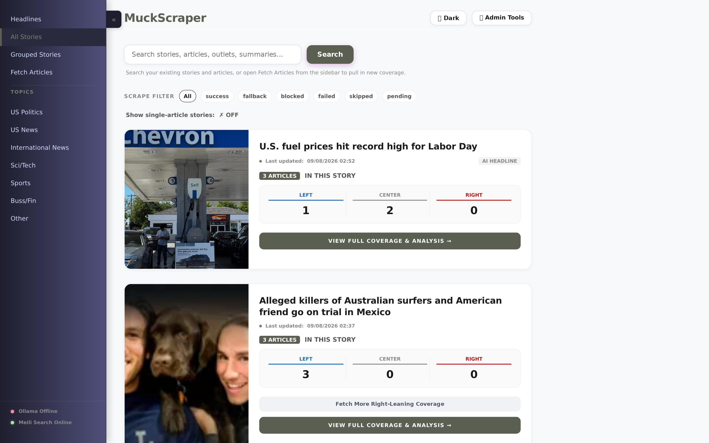
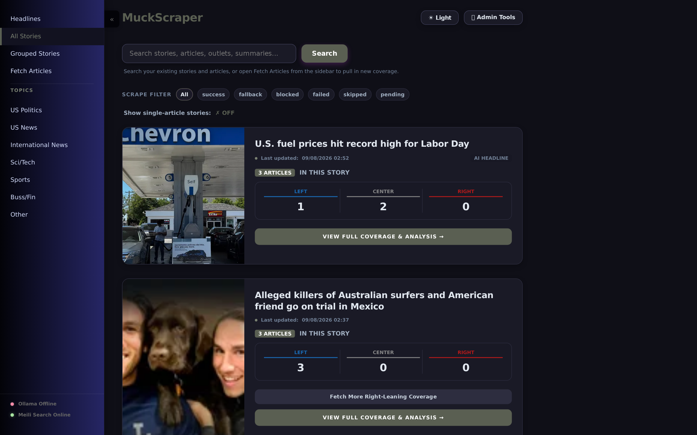
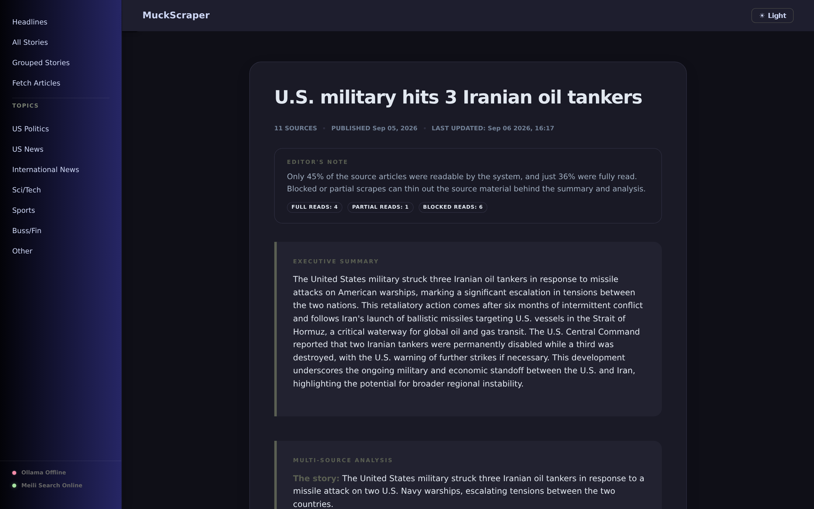
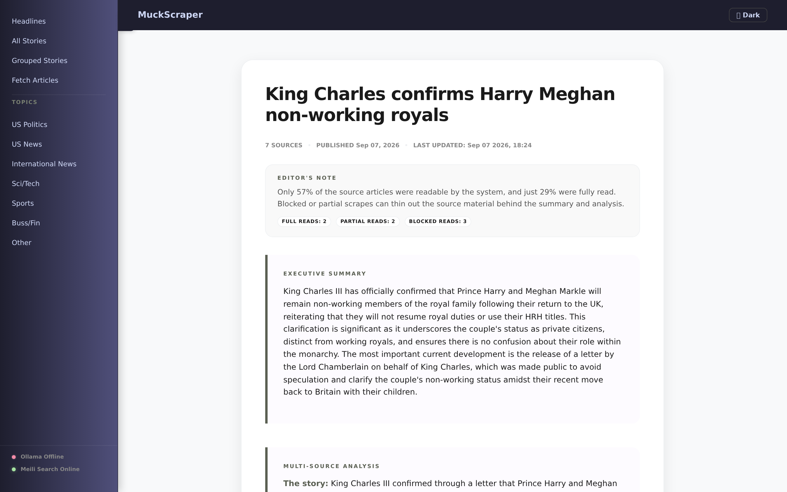
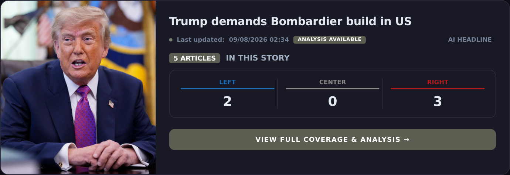

# MuckScraper

### A self-hosted news aggregator with multi-source grouping and local LLM analysis

> **TL;DR:** MuckScraper pulls news from multiple sources, groups related articles into stories, scores outlet bias, and generates local AI summaries and deeper reports on your own hardware.

---

## Live Deployment

**[MuckScraper.news](https://muckscraper.news)** runs on this codebase. It publishes two balanced headline editions per day and is a working example of what MuckScraper produces: story grouping across outlets, bias labeling, AI-generated summaries, and ranked coverage from across the political spectrum.

---

## Screenshots

### Main Feed


### Dark Mode


### Multi-Source Story View



### Bias Tags



### Article Reader


---

## Why This Is Different

Most aggregators are just article lists. MuckScraper is story-first.

- **Cross-outlet story grouping**: related coverage from multiple publishers is clustered into a single story so you can compare framing side by side.
- **Bias visibility**: outlets are labeled on a left-to-right scale using AllSides where available and local model scoring otherwise.
- **Local-first AI analysis**: summaries, deep reports, topic classification, and outlet scoring run against your own Ollama models by default. Gemini, Groq, and any OpenAI-compatible endpoint (OpenRouter, DeepSeek, OpenAI, a local vLLM) are supported alternatives, and the two workloads can be split across providers — see LLM behavior below.
- **Edition workflow**: the system can publish fixed-size headline editions from the broader story pool instead of leaving everything as a raw reverse-chronological feed.
- **Self-hosted**: no subscription requirement, no ad-tech, and no mandatory third-party cloud inference.

---

## What It Does

MuckScraper fetches articles from multiple news APIs and RSS feeds on a schedule, scrapes article text, groups related coverage into stories, classifies topics, scores outlet bias, and generates summaries or deeper reports when content is ready. It includes admin tooling for scrape review, retries, regrouping, and monitoring scrape health over time.

---

## Tech Stack

- **Backend:** Python, Flask, SQLAlchemy
- **Database:** PostgreSQL with pgvector
- **Search:** Meilisearch
- **News Data:** NewsAPI and GNews, with RSS support
- **LLM Runtime:** Ollama by default; Gemini, Groq, or any OpenAI-compatible endpoint optional
- **Embeddings:** `nomic-embed-text`
- **Scraping:** BeautifulSoup, readability-lxml, Playwright
- **Runtime:** Docker and Docker Compose

---

## Project Structure

```text
muckscraper/
├── aggregator/
│   ├── __init__.py                 # App factory
│   ├── app.py                      # Main Flask entry point
│   ├── models.py                   # SQLAlchemy models
│   ├── filters.py                  # Jinja filters and display helpers
│   ├── constants.py                # Shared constants (topics, bias buckets, etc.)
│   ├── article_signals.py          # Article engagement and signal tracking
│   ├── search.py                   # Meilisearch integration
│   ├── story_view.py               # Story view helpers
│   ├── blueprints/
│   │   ├── admin.py                # Admin and maintenance routes
│   │   ├── auth.py                 # Login/logout routes
│   │   └── public.py               # Public reader routes
│   ├── static/                     # Shared static assets
│   └── templates/                  # Jinja templates
├── migrations/                     # Alembic migration files
├── news_fetcher/
│   ├── Dockerfile                  # Scheduler image
│   ├── fetch_and_store_articles.py # Ingestion, grouping, and edition publishing
│   ├── rss_fetcher.py              # RSS ingestion helpers
│   ├── scheduler.py                # Scheduled fetch runner
│   ├── scraper.py                  # Scrape pipeline and fallback logic
│   ├── story_grouper.py            # Story clustering logic
│   ├── summarizer.py               # Story and article summaries
│   ├── topic_classifier.py         # Topic classification helpers
│   ├── headline_generator.py       # AI headline generation for grouped stories
│   ├── allsides_lookup.py          # AllSides bias data lookup
│   ├── outlet_bias_llm.py          # LLM-based outlet bias scoring
│   ├── backfill_images.py          # Utility: backfill missing story images
│   ├── cleanup_duplicates.py       # Utility: deduplicate articles and stories
│   └── merge_outlets.py            # Utility: merge duplicate outlet records
├── tests/                          # Automated tests
├── boot.sh                         # Docker app entrypoint
├── bootstrap_admin.py              # Admin user creation script
├── docker-compose.yml              # Local stack definition
├── Dockerfile                      # App image
├── requirements.txt                # Python dependencies
└── .env.sample                     # Example environment configuration
```

---

## Security Warning

Do not expose admin routes directly to the public internet.

Recommended deployment:
- keep the admin interface on a local network
- or put it behind a VPN such as WireGuard or Tailscale

---

## Requirements

- Docker and Docker Compose
- NewsAPI key
- GNews API key
- Ollama or another compatible local model endpoint
- PostgreSQL with pgvector support

---

## Installation

```bash
git clone https://github.com/grregis/muckscraper.git
cd muckscraper
./install.sh
```

The first run creates `.env` from `.env.sample` and stops so you can fill in
your API keys, Ollama host, and admin login. Run it again once that's done —
it builds the core services, sets up the database (pgvector extension +
tables) and admin user, and starts the scheduler. Safe to re-run.

Then open `http://localhost:5000`.

<details>
<summary>Manual steps (if you'd rather not use install.sh)</summary>

```bash
cp .env.sample .env
# Edit .env with your API keys, local model host, and admin login
docker compose up -d --build postgres meilisearch app
docker compose exec app python bootstrap_admin.py
docker compose up -d scheduler
```

</details>

If you pull schema changes later:

```bash
docker exec muckscraper-app-1 flask db upgrade
```

### Optional workflow integrations

MuckScraper can be extended with personal workflow hooks, such as n8n webhooks for fetch reports or Ollama power management, and Matrix notifications for status messages. These are not part of the default Docker Compose setup; add them with your own environment variables, compose override, or notification code if you want those workflows.

---

## Current Features

### Editions and ranking
- Configurable scheduled editions per day
- 20-story edition target
- Repeats held back unless there is meaningful new coverage
- Carry-over logic for underfilled editions
- Publish-time duplicate-story filtering for same-event headline candidates

### News fetching
- Scheduled multi-topic fetches
- On-demand fetch by topic or custom query
- NewsAPI and GNews support
- RSS ingestion support
- Duplicate article detection by URL and normalized title/outlet checks
- Full-text search across articles and stories via Meilisearch

### Scraping and reliability
- Full article scraping during ingestion
- Multi-step scrape fallback pipeline
- Scrape telemetry stored per article
- Bad-scrape auditing and status-aware retries
- Domain and URL cooldown behavior for repeated failures
- Admin monitoring for scrape outcomes and blocklist behavior

### Story grouping and summaries
- Vector-based story grouping with pgvector
- LLM-assisted borderline match handling
- AI story headlines for grouped stories
- Story summaries and deeper reports
- Per-article summaries
- Stable-story skipping so unchanged stories do not keep reprocessing

### Bias and metadata
- Outlet bias labels with AllSides or model-based sourcing
- Topic classification
- Image capture from upstream feeds
- Archived edition-story image support for stable published output

### Admin tools
- Manual scrape and rescrape actions
- Bulk scrape-missing workflow
- Scrape audits
- Story regrouping and topic reclassification
- Outlet merge tooling
- Ollama wake and catch-up helpers
- Topic and RSS feed management
- Editable LLM prompts, each resettable back to its original default
- Pipeline run schedule management (add/edit/delete when fetch-only vs. full-pipeline runs happen)
- Container restart from the admin UI, blocked automatically while a fetch or other background task is running

---

## Customization

### Topics, feeds, queries, prompts, filters, and schedule

All DB-backed and admin-editable, no code change needed:
- Topics: `/admin/topics`
- RSS feeds: `/admin/rss-feeds`
- LLM prompts: `/admin/prompts` (each resettable back to its original default)
- Pipeline run schedule — *when* fetch-only vs. full-pipeline runs happen: `/admin/pipeline-schedule`
- Scheduled fetches — *what* each run pulls from NewsAPI/GNews: `/admin/scheduled-fetches`
- Ingestion blocklist — sources and headline keywords refused before anything is
  stored: `/admin/ingestion-blocks`

The last two are what closed [issue #1](https://github.com/grregis/MuckScraper/issues/1).
The shipped defaults reflect the maintainer's reading habits — US-centric topics,
a gaming-news filter — but they are defaults now rather than the only option, so
adapting the project to a different beat no longer means a fork.

### LLM behavior

**Choosing a provider (`LLM_PROVIDER`).** Ollama is the default and the point of
the project, but `LLM_PROVIDER` also accepts `gemini`, `groq`, and `openrouter`.
The OpenRouter path is a generic OpenAI-compatible client — set `OPENROUTER_HOST`
to any endpoint speaking `chat/completions` (DeepSeek, OpenAI, Together, a local
vLLM) and it works with no code change. Embeddings are a separate axis
(`EMBEDDING_PROVIDER`) and only Ollama and Gemini can serve them; Groq has no
embedding models and OpenRouter routes chat completions only.

**Splitting the two workloads (`LLM_FAST_PROVIDER`).** A run makes ~1,140
mechanical calls against ~65 summary/deep-report calls (see below). Those two
groups can go to *different* providers, which is the answer to "my GPU can't run
a model good enough for summaries":

```
LLM_PROVIDER=openrouter      # the ~65 summaries and deep reports
LLM_FAST_PROVIDER=ollama     # the ~1,140 grouping/classification/bias calls
```

The volume stays local and free; only the handful of calls a reader actually
sees go to the cloud. Note the ordering reads backwards from "send simple things
to Ollama" — the global is the cloud provider and Ollama is the exception —
because that is the only arrangement where leaving `LLM_FAST_PROVIDER` blank
keeps single-provider installs behaving exactly as before.

Health checks are per-tier, so the pipeline degrades rather than stops: if the
local box is asleep, summaries still run and only classification is skipped, and
vice versa. This closed
[issue #8](https://github.com/grregis/MuckScraper/issues/8).

**Model tiers (`OLLAMA_FAST_MODEL`).** A full pipeline run makes roughly 1,200
sequential LLM calls, and about 1,140 of them are mechanical — story-grouping
confirmations, topic classification, headline generation, outlet bias — whose
output is a label, a yes/no, or a short headline. Only ~65 are the summaries and
deep reports a reader actually sees. Setting `OLLAMA_FAST_MODEL` to a smaller
model routes the mechanical calls to it while summaries stay on `OLLAMA_MODEL`.

This matters most when `OLLAMA_MODEL` is too large for your GPU. Compare
`size_vram` against `size` in `curl $OLLAMA_HOST/api/ps` — if `size_vram` is
smaller, the rest is running on CPU and every call pays for it. Worse, a model
that fills the card leaves no room for the embedding model, so Ollama swaps the
two in and out on every article. A fast model that fits alongside
`nomic-embed-text` avoids both problems.

Leave it blank to use `OLLAMA_MODEL` for everything (the original behavior).
`GEMINI_FAST_MODEL` and `GROQ_FAST_MODEL` do the same for those providers.

Prompt wording itself is editable at `/admin/prompts` (see above) with no
code change needed. The surrounding logic — persona/analysis-type
selection, story-grouping thresholds, etc. — still lives in:
- `news_fetcher/summarizer.py`
- `news_fetcher/topic_classifier.py`
- `news_fetcher/story_grouper.py`
- `news_fetcher/headline_generator.py`
- `news_fetcher/outlet_bias_llm.py`
- `news_fetcher/allsides_lookup.py` (bias data source)

### Scrape and grouping tuning

Important knobs include:
- similarity thresholds in `news_fetcher/story_grouper.py`
- heuristic ingest filters (roundup/advice-column/betting title patterns) in
  `aggregator/article_signals.py` — the source and headline-keyword blocklists
  themselves are admin-editable at `/admin/ingestion-blocks`
- retry and cooldown behavior in `news_fetcher/scraper.py`

---

## Notes

- This repo intentionally documents the main application and ingestion pipeline, not every deployment-specific integration.
- Optional local integrations can exist around the core stack without being required for the open-source app itself.

---

## Special Thanks

- **[Meilisearch](https://www.meilisearch.com/)** — powers full-text search across articles and stories. Fast, easy to self-host, and a genuinely great fit for this kind of project.
- **[Langfuse](https://langfuse.com/)** — LLM observability and tracing, invaluable for debugging prompts and iterating on model behavior during development.
- **[AllSides](https://www.allsides.com/)** — outlet bias ratings that inform MuckScraper's bias labeling. Their commitment to balanced news exposure is very much in the spirit of this project.
